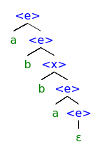

# einstaklingsverkefni - v1

## 1.
B)
## 2. 
### a)
regluleg segð:  
```regex
(a*b*c*)*
```

stöðuvél:  
  

### b)
regluleg segð:  
```regex
c*b*a*
```

stöðuvél:  


### c)
þetta gengur ekki, málið er ekki reglulegt en í fljótu bragði virðist þetta vera svipað dæmi og í hópverkefni 1, þe.  
```bnf
<y> ::= "b" <y> "c" | ε
```  
en lykilatriðið hér er að `<y>` getur ekki farið út fyrir sitt scope og virkar þessvegna ólíkt þessu máli

### d)
regluleg segð:  
`a('+'a)*` eða `(a'+')*a`

stöðuvél:  


### e)
þetta mál er ekki reglulegt  

### f)
þetta mál er ekki reglulegt

## 3. 
regex: 
```
a*(ba*b)*a*
```
stöðuvél:  
  

BNF:
``` BNF
<e> ::= a <e> | b <x> | ε
<x> ::= b <e> | a <x>
```

útleiðslutré:  



## 4.
BNF:  
```bnf
<e> ::= x | ( <e> ) | <e> + <e>
```

EBFN:
```bnf
e ::= x | ( e ) | e + e
```

málrit:  
