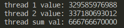
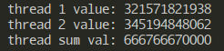
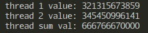

# vikublað 13 - forritunarmál

# forrit:

```java
"threads.mexe" = main in
{{
    main =
    fun() {
        var c = makeChannel();
        var s = makeChannel();

        ;;; Notkun:     Producer();
        ;;; Fyrir:      c er container skilgreindur utan fallsins
        ;;; Eftir:      Tölurnar 1^2,2^2,...,10000^2 hafa verið sentar inn í c
        rec fun Producer() {
            for (var i = 1; i <= 10000; i=i+1) {
                c <- i*i;
            }
        };
        
        go{Producer()};
        go{Producer()};

        ;;; Notkun:     Consumer();
        ;;; Fyrir:      c og s eru channel skilgreind utan fallsins
        ;;; Eftir:      10000 tölur úr c hafa verið lagðar saman og sentar inn í s
        rec fun Consumer() {
            var n = bigInteger(0);
            for (var i = 0; i < 10000; i=i+1) {
                n = n + <-c;
            };
            s <- n;
        };

        go{Consumer()};
        go{Consumer()};

        val x = <- s;
        val y = <- s;

        writeln("thread 1 value: " ++ x);
        writeln("thread 2 value: " ++ y);
        writeln("thread sum val: " ++ (x+y))
    };
}}
*
BASIS
;
```

## keyrslur:
| | x | y | summa | mynd | 
|:---|---|---|---|:---:|
|keyrsla 1  |329585976988|337180693012|666766670000||
|keyrsla 2  |321571821938|345194848062|666766670000|
|keyrsla 3  |321315673859|345450996141|666766670000|
|meðaltal |324157824261|342608845738|666766670000||