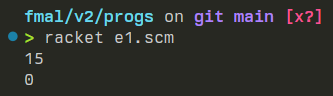
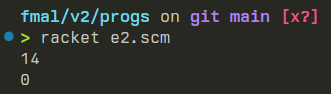
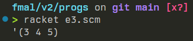

# einstaklinsverkefni verkefnablað 2

## 1.
forrit:  
```scheme
;; notkun: (sum x)
;; fyrir: x=(x1 x2 ... xN) er listi talna, getur verið tómur
;; gildi: talan x1+x2+...+xN, summa allra talna í listanum
(define (sum x)
    (if (null? x) 
        0 
        (+ (car x) (sum (cdr x))))    
)

(sum '(1 2 3 4 5))
(sum '())
```  

keyrsla:  


## 2.
forrit:  
```scheme
;; notkun: (squaresum x)
;; fyrir: x=(x1 x2 ... xN) sem er listi talna, getur verið tómur
;; gildi: talan x1*x1+x2*x2+...+xN*xN
(define (squaresum x)
    ;; notkun: (helper acc arr)
    ;; fyrir:   acc er tala, 
    ;;          arr=(x1 x2 ... xN)
    ;; gildi: talan x1*x1+x2*x2+...+xN*xN
    (define (helper acc arr)
        (if (null? arr) acc
            (helper 
                (+ acc (* (car arr) (car arr)))
                (cdr arr)
            )
        )
    )
    ;; stofn fallsins squaresum:
    (helper 0 x)
)

(squaresum (list 1 2 3))
(squaresum '())
```  

keyrsla:  


## 3. 
forrit:  
```scheme
;; notkun:  ((incall y) x)
;; fyrir:   y er tala,
;;          x=(x1 x2 ... xN) er listi talna, ekki tómur
;; gildi:   talnalistinn (x1+y x2+y ... xN+y)
(define (incall y)
    ;; notkun:  (incall y)
    ;; fyrir:   y er tala,
    ;; gildi:   fallið inner með töluna y sem breytu
    (define (inner x)
        (if (null? (cdr x))
            (list (+ y (car x)))
            (cons (+ y (car x)) (inner (cdr x)))
        )
    )

    inner
)

((incall 2) '(1 2 3))
```  

keyrsla:  
