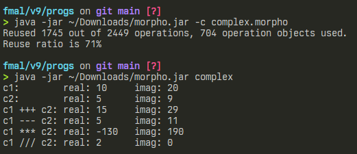

# verkefnablað 9 - einstaklingsverkefni

## einingin complex.mmod
```java
"complex.mmod" =
!
{{
;;; Notkun:     z = createComp(x,y);
;;; Fyrir:      x og y eru rauntölur
;;; Eftir:      z er listi þar sem haus er 
;;;             raunpartur og hali er ímyndaði partur
createComp = 
    fun(real, imag)
    {
        return [real, imag];
    };

getReal = 
    ;;; Notkun:     a = getReal(z);
    ;;; Fyrir:      z er tvinntala
    ;;; Eftir:      a er raunpartur z        
    fun(z)
    {
        return head(z);
    };

getImag = 
    ;;; Notkun:     b = getImag(z)
    ;;; Fyrir:      z er tvinntala
    ;;; Eftir:      b er ímyndaði partur z
    fun(z)
    {
        return head(tail(z));
    };

printImag =
    ;;; Notkun:     out = printImag(z);
    ;;; Fyrir:      z er tvinntala
    ;;; Eftir:      out er gildi á z
    fun(z)
    {
        val out = "real: " ++ getReal(z) ++ "  \timag: " ++ getImag(z);
        return out;
    };

+++ = 
    ;;; Notkun:     z = a +++ b;
    ;;; Fyrir:      a og b eru tvinntölur
    ;;; Eftir:      z er tvinntölusamlagning a og b
    fun(a, b)
    {
        return createComp(getReal(a) + getReal(b), getImag(a) + getImag(b));
    };

--- = 
    ;;; Notkun:     z = a --- b;
    ;;; Fyrir:      a og b eru tvinntölur
    ;;; Eftir:      z er tvinntölufrádráttu a og b
    fun(a, b)
    {
        return createComp(getReal(a)-getReal(b),getImag(a)-getImag(b));
    };

*** = 
    ;;; Notkun:     z = a *** b;
    ;;; Fyrir:      a og b eru tvinntölur
    ;;; Eftir:      z er tvinntölumargföldun a og b
    fun(a, b)
    {
        return createComp(
            getReal(a)*getReal(b)-getImag(a)*getImag(b),
            getReal(a)*getImag(b)+getImag(a)*getReal(b)
        );
    };

/// = 
    ;;; Notkun:     z = a /// b;
    ;;; Fyrir:      a og b eru tvinntölur
    ;;; Eftir:      z er tvinntöludeiling a og b
    fun(a, b)
    {
        val temp = getReal(b)*getReal(b)+getImag(b)*getImag(b);
        return createComp(
            (getReal(a)*getReal(b)+getImag(a)*getImag(b))/temp, 
            (getImag(a)*getReal(b)-getReal(a)*getImag(b))/temp
        );
    };
}};
```

<div style='page-break-after: always;'></div>

## testforrit fyrir complex.mmod eininguna
```java
;;; Test forrit fyrir complex.mmod
"complex.mexe" = main in
{{
main =
	fun()
	{
		try
		{
			val c1 = createComp(10, 20);
            writeln("c1: \t   " ++ printImag(c1));

			val c2 = createComp(5, 9);
            writeln("c2: \t   " ++ printImag(c2));

            val temp1 = c1 +++ c2;
            writeln("c1 +++ c2: " ++ printImag(temp1));
            
            val temp2 = c1 --- c2;
            writeln("c1 --- c2: " ++ printImag(temp2));
            
            val temp3 = c1 *** c2;
            writeln("c1 *** c2: " ++ printImag(temp3));
            
            val temp4 = c1 /// c2;
            writeln("c1 /// c2: " ++ printImag(temp4));


		}
		catch(e)
		{
			printExceptionTrace(&e)
		}
	};
}}
*
"complex.mmod"
*
BASIS
;
```

<div style='page-break-after: always;'></div>

## útkoma úr þýðingu og keyrslu á complex.mexe

### copy paste
```bash
Reused 1745 out of 2449 operations, 704 operation objects used.
Reuse ratio is 71%
c1:        real: 10     imag: 20
c2:        real: 5      imag: 9
c1 +++ c2: real: 15     imag: 29
c1 --- c2: real: 5      imag: 11
c1 *** c2: real: -130   imag: 190
c1 /// c2: real: 2      imag: 0
```

### skjáskot
